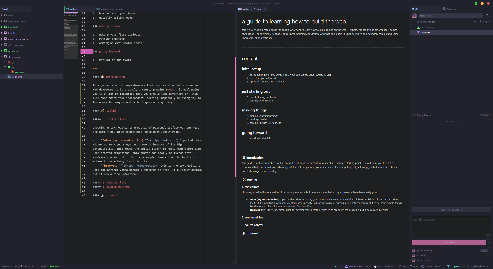
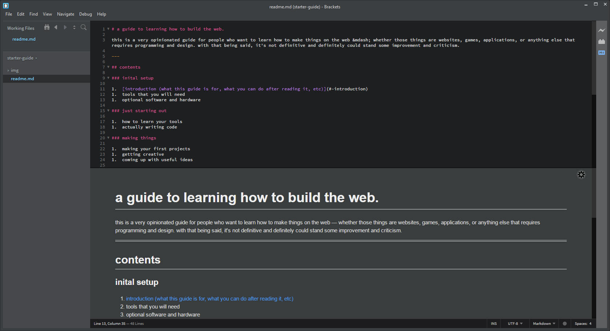
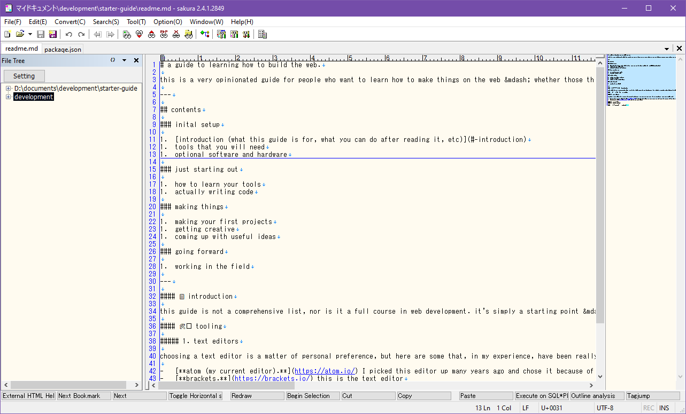
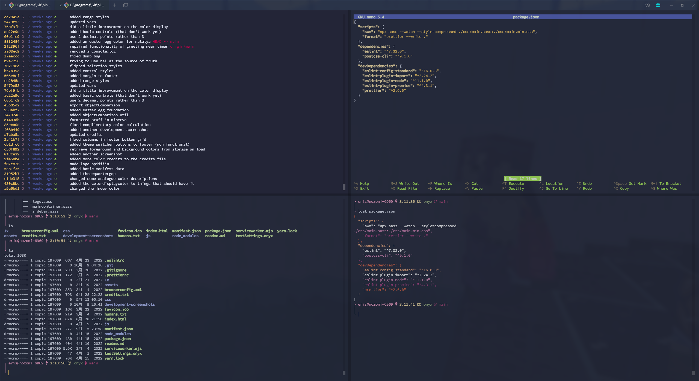
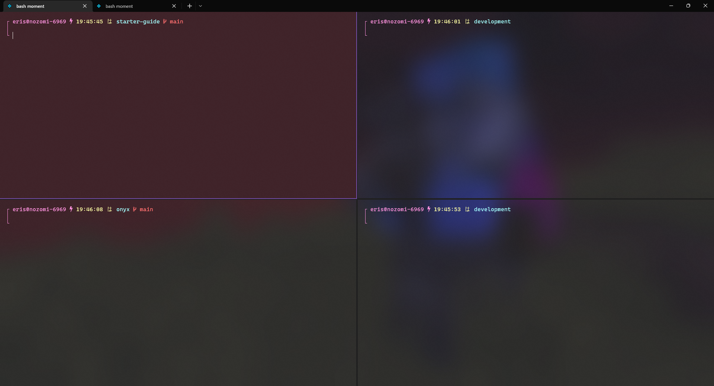
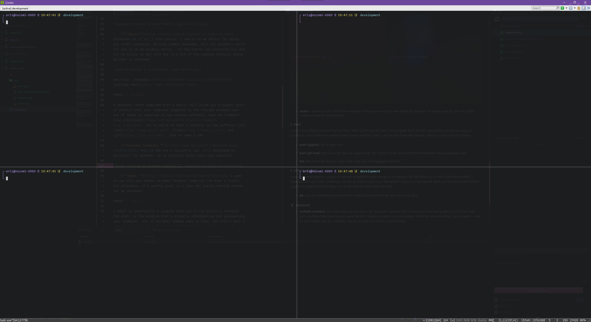

# a guide to learning how to build the web.

my friends often ask me to teach them to do what I do. I don't want to, because I'm not very good at teaching. but I am good at writing documentation, and this is kind of like that!

this is a very opinionated guide for people who want to learn how to make things on the web &mdash; whether those things are websites, games, applications, or anything else that requires programming and design.

this is _**only**_ a starting point, a brief overview. you will  certainly need to do a lot of your own research. it's not definitive and definitely could stand some improvement and criticism.

---

## contents

### inital setup

1.  [introduction (what this guide is for, what you can do after reading it, etc)](#introduction)
1.  [tools you will need](#tooling)
1.  [optional software and hardware](#optional)

### just starting out

1.  [how to learn your tools](#learning-your-tools)
1.  [actually writing code](#writing-some-code)

### making things

1.  [making your first projects](#first-projects)
1.  [coming up with useful ideas](#making-useful-software)
1.  [getting creative](#getting-creative)

### going forward

1.  working in the field
1.  constant improvement

---

## part one: inital setup.

### introduction

again, this guide is not a comprehensive list, nor is it a full course in web development. it will point you to a list of resources that you should take advantage of. this will supplement your independent learning, hopefully allowing you to learn new techniques and technologies more quickly.

**important:** if you don't understand a term, or don't understand how to do something in this guide, look it up!! there are tutorials for things even as simple as installing software. don't sit in the dark, look for the information! it is out there!

this guide is aimed primarily at windows users, because that's what I'm most familiar with.

### tooling

#### web browsers

you should download both [google chrome](https://www.google.com/chrome/) and [firefox](https://www.mozilla.org/en-US/firefox/new/) at the very least. when you're making websites, testing in multiple browsers is very important.

#### text editors

choosing a text editor is a matter of personal preference, but here are some that have been really good to me.

-   [**atom (my current editor).**](https://atom.io/) I picked this editor up many years ago and chose it because of its high extensibility. this means the editor itself is fully modifiable with user-created extensions. this editor can easily be turned into whatever you want it to be, from simple things like the font / color scheme to underlying functionality.

-   [**brackets.**](https://brackets.io/) this is the text editor I used for several years before I switched to atom. it's really simple, but it has a nice interface and a wide selection of user created extensions at your fingertips.

-   [**sakura**](https://sakura-editor.github.io/index.en.html) barebones as it is, I love sakura. I use it as my editor for doing git stuff (rebasing, writing commit messages, etc) but probably would not use it as my primary editor - it has pretty low extensibility and can be tricky to get into due to a lot of the reading material being written in japanese.

see also: [notepad++](https://notepad-plus-plus.org/downloads/), [sublime text](https://www.sublimetext.com/).

#### terminals

a terminal (when combined with a shell) will allow you a higher level of control over your computer compared to the average windows user. one of these is required to use certain software, such as [command-line interfaces](https://en.wikipedia.org/wiki/Command-line_interface). you're going to need a terminal to use software like [npm](https://www.npmjs.com/), [node](https://nodejs.org/), and [git](https://git-scm.com/), just to name a few.

-   [**tabby.**](https://tabby.sh/) this is the one I currently use. I find it to be very smooth, quick, and pretty (the most important trait). it's quite customizable, and comes pre-packed with like a million color schemes!

-   [**windows terminal.**](https://www.microsoft.com/store/apps/9n0dx20hk701) this is a nice one. it's developed by microsoft for windows, so it actually works very very smoothly, and is easy to install.

-   [**cmder.**](https://github.com/cmderdev/cmder/releases) I used to use this one before windows terminal came out and even a little bit afterward. it's highly customizable, and I really valued the ability to save very specific panel layouts and configurations to quickly set up a workspace. it's just not pretty-looking enough for my purposes.

#### shells

a shell is essentially a program that you'll run within a terminal. the shell is the program that's actually interpreting and processing your commands. one of the most common ones is bash, and that's what I use. I've also listed fish because I think it's a nice piece of software.

-   [**bash (cygwin).**](https://www.cygwin.com/packages/summary/bash.html) this is what I use.

-   [**bash (git bash).**](https://gitforwindows.org/) this one is the same as cygwin bash, but I found it to be more difficult to install new software packages with.

-   [**fish.**](https://fishshell.com/) this one looks fun and comes with some nice autosuggestion features.

#### version control

a version control system is a piece of software designed to track changes in a codebase. this will allow you to write code incrementally &mdash; meaning that if you break something, you can go back to a previous "checkpoint". it also is a huge benefit when you're working with multiple people on a team, because it helps you to see who did what within the code.

-   [**git.**](https://git-scm.com/) git is an extremely powerful version control system and the most ubiquitous item of its type.

### optional

-   **multiple monitors.** this might help you out quite a lot. seeing the software you're working on while being able to look at the code you're writing at the same time is a great benefit. I started out using only one monitor, but at the time of writing I use 4 to work &mdash; one for a text editor, one for a terminal, one for discord, and one for a web browser.

-   **task management software.** I'm an extremely disorganized person, so I use [aeriform tape](https://aeriform.itch.io/tape) to help me manage my day-to-day tasks.

---

## part two: just starting out.

### learning your tools

this is something that's different for everyone. I'm the type of person to read a quick-start guide and then trial-and-error my way through everything else. it's up to you to learn your tools the way you know best, but the best way to learn is by doing. prepare to use google a lot.

#### the shell

one of the first things you should do with your shell and terminal after setting up is to learn how to navigate around your computer. learn how the filesystem is arranged. figure out how to move between folders, create / delete new folders and files, and how to edit them &mdash; all from the command line. after this step, you should be able to set up a new project from scratch using only shell commands.

resources:

1.  [bash manual](https://linux.die.net/man/1/bash)
1.  [bash commands cheat sheet](https://algodaily.com/lessons/bash-commands-cheat-sheet1)

#### the editor

typically, editors will have some sort of starting guide to help new users get used to the environment. for example, atom has its welcome screen (accessed by opening the software for the first time, or by typing `ctrl+shift+p` and searching for `welcome: show`). here's a basic exercise you can do when you first open up a new editor &mdash; answer these questions.

1.  how do I create a new file? is there a graphical menu? a key combination?
1.  how do I delete the file from within the editor?
1.  is there a way to see a list of currently opened files?
1.  how do I switch between files? can I work on two or more files in parallel?
1.  what kind of extensions are available to me? how can I increase the functionality of the editor to better suit my needs?
1.  does the editor save my settings so I can pick up where I left off after closing it?

those are just some basic questions that I think about when trying a new editor. you can try these, and along the way you'll probably think of some questions of your own.

### writing some code

at this point you're ready to get into the actual work. now that you're a little familiar with how to use your editor and your terminal, your two primary tools, you can start to write some code. but how do you learn programming languages? here are some good resources for learning the most common programming languages used for web development:

1.  [**codewars.**](https://www.codewars.com/) create an account here and practice writing at least javascript. javascript is the primary scripting language used on the web, so it's critical knowledge. it wouldn't hurt to also practice some other languages as well! any language will improve your programming skills in some way.
1.  [**mdn's _getting started with the web_.**](https://developer.mozilla.org/en-US/docs/Learn/Getting_started_with_the_web) this is an excellent guide on how to use tools to make things on the web. I highly recommend going through this in great detail. set aside a couple of hours.
1.  [**mdn's _structuring the web with html_.**](https://developer.mozilla.org/en-US/docs/Learn/HTML) this is a guide on how to understand and write basic html.
1.  [**mdn's _learn to style html using css_.**](https://developer.mozilla.org/en-US/docs/Learn/CSS) this is a guide on how to understand and write basic css, which changes how html is displayed.
1.  [**mdn's _javascript - dynamic client-side scripting_.**](https://developer.mozilla.org/en-US/docs/Learn/JavaScript) this is a guide on how to understand and write basic javascript, which allows you to make the web more interactive.

## part three: making things

### first projects

so you're familiar with your tools, you know a little bit about your languages &mdash; now, what should you make? I have ideas on how to decide what is a good or bad thing to make in the way of pietro righi riva's [_rejecta_](https://actofplay.com/rejecta/) and my own [_thesis_](https://github.com/jpegzilla/thesis). with some guidelines in place, the trickies part of the process is finding a problem you want to solve. I think the best software arises from the developers own needs. for example, tim berners-lee invented the internet as we know it today because he saw a need for a way for scientists to share information.

of course, you don't have to have some kind of revolutionary idea - maybe you just need an app you can use to manage your d&d game, or a website to serve as your photography portfolio. no matter what it is, though, the idea is up to you.

this is the part where you're going to want to get familiar with [github](https://github.com/). github is a platform that provides a way for you to share and collaborate on software managed by git version control, which we talked about above. go on github's website and create an account. after you do that, try to create a new repository (just a test, a throwaway). try getting the repository onto your computer from github. figure out how to sync changes between your local files in the repository and github. resources:

1.  [github's get started guide](https://docs.github.com/en/get-started)

start a simple project with any sort of idea that you like. get it set up on github. use html, javascript, and css. don't be afraid to make mistakes. your first project is going to be full of errors &mdash; but you'll learn a lot from them. again, this project doesn't have to be anything super high-tech, and it can be as small-scale as you'd like. the point of this stage is to get used to building things using all the tools at your disposal.

### making useful software

what makes a piece of software "useful"? the definition can depend on a lot of things, but here's a good metric: software is useful when it solves an existing problem in a more efficient, elegant, or beautiful way than previous solutions. this means that a new calculator app cannot be truly _useful_ unless it is massively innovative. with such a guideline in mind, making more useful software becomes simple.

### getting creative

go to [awwwards.com](https://www.awwwards.com/) and browse the selection of websites. these are award-winning websites that stand out for their cutting edge design, highly innovative functionality, or important and interesting content. these represent some of the highest standards for modern web developers. exploring these on a regular basis will help you to understand design trends on the web, and the who, what, and why of web development these days.

1.  **who** is making the highest quality of websites (what agencies, what designers and developers)
1.  **what** are people making? what kind of company websites, what kind of personal portfolios? what kind of product marketing pages?
1.  **why** are developers using the technologies they're using? what's the driving force behind these trends? why are websites being designed with _x_ type of feature so often?

understanding the landscape will help you to extrapolate and develop your own style and creativity. here are some other miscellaneous resources that will help you find out what's possible to create on the web:

1.  [muz.li](https://muz.li/)
1.  [anideafora.website](https://anideafora.website/)
1.  [hoverstat.es](https://www.hoverstat.es/)
1.  [css design awards](https://www.cssdesignawards.com/)

### going forward

_work in progress..._